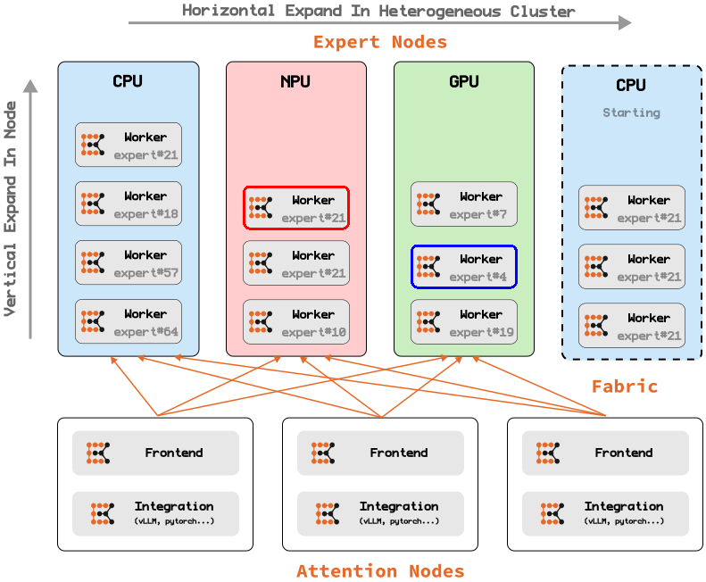

# Expert Kit

> [!CAUTION]
> Early Work-in-Progress. This project is currently a proof-of-concept demo and is under active development. It is not intended for production use and may contain significant bugs, security vulnerabilities, and unexpected behavior. We appreciate community feedback and contributions as we continue to build and refine this project.

**Expert Kit** is a high-performance framework for scalable MoE (Mixture of Experts) LLM inference. It enables efficient deployment of Expert Parallelism (EP) clusters backed by heterogeneous hardware to tackle the unique challenges of serving MoE models.

<picture>
  <source media="(prefers-color-scheme: dark)" srcset="./doc/assets/arch-illustration-dark.svg">
  
</picture>

## Why Expert Kit

The Challenge: Modern MoE models like DeepSeek-V3 contain up to 671B parameters, with nearly 98% dedicated to experts. Traditional inference approaches face:

- Extreme memory pressure on single devices
- Inefficient resource allocation with fixed model deployment
- Limited scaling options that require replicating entire models
- Poor utilization of heterogeneous hardware capabilities

Our Solution: **Expert Kit** decouples attention computation from expert computation, creating a distributed architecture that enables:

- Fine-grained resource management at individual expert level
- Dynamic scaling based on actual expert usage patterns
- Seamless integration of heterogeneous hardware
- Zero-downtime cluster expansion as needs grow
- Running massive MoE models on every day hardware

## Quick Start

Here exists some tutorials to help you quickly start with Expert Kit.

1. [DeepSeek-tiny](./doc/tutorial/deepseek-tiny.md): A tailored MoE model with DeepSeek-V3 architecture and small parameter count, designed for quick evaluation and testing of the Expert Kit framework.
2. [Qwen3-30B-A3B](./doc//tutorial/qwen3-moe-a3b-demo.md): A demo for running the Qwen3-30B-A3B model with Expert Kit, showcasing the framework's capabilities in handling real-world MoE models.

## Key Features

Expert-Level Parallelism

- Fine-Grained Scaling: Schedule and allocate resources at individual expert level
- Dynamic Expert Management: Load experts based on usage patterns and demand
- Seamless Expansion: Add new compute nodes with automatic workload redistribution

Heterogeneous Hardware Support

- Mixed Hardware Pipelines: Combine different GPU generations, CPUs, and accelerators
- Intelligent Placement: Assign experts to the most appropriate compute resources
- Optimized Communication: Efficient cross-device tensor transfer with minimal overhead

Memory & Framework Optimization

- Dramatic Memory Reduction: Offload up to 98% of parameters through expert disaggregation
- Ecosystem Integration: Works with vLLM and Transformers, leveraging PagedAttention and optimized kernels
- Simple Adoption: Drop-in replacement for standard MoE layers with minimal code changes

Universal Accessibility

- Consumer Hardware: Run 600B+ parameter models across everyday devices
- Enterprise Efficiency: Maximize resource utilization in production environments
- Flexible Deployment: Scale from personal setups to data centers with the same architecture

## Repository Map

- [ek-computation](./ek-agent): performs schedule(frontend) and computation(backend) task.
- [ek-db](./ek-edb): supports registering and loading experts' weight in fine-grained granularity.
- [ek-benchmark](./ek-benchmark): contains several micro-benchmarks help you know the performance.
- [ek-solution](./ek-solution): contains several recipes to quickly setup a running cluster.

## Roadmap

### Core Features

- [x] **Frontend** for request schedule
  - [x] Simple Executor
  - [ ] Extensible Executor
  - [ ] Schedule Interface
- [x] **Backend** compute engine for expert computation
  - [x] pytorch
  - [ ] onnxruntime
  - [ ] candle
- [x] **Integration** with existing framework for attention computation
  - [x] pytorch
  - [x] vLLM
- [x] **Transport** channel between frontend and backend
  - [x] gRPC
  - [ ] RDMA
  - [ ] DSM
