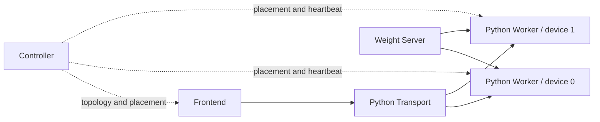

# Expert Kit

Expert Kit is a distributed inference system for Mixture-of-Experts models. It
keeps attention and model routing in a Frontend process and places routed
experts on independently managed Workers.

> [!CAUTION]
> Expert Kit is under active development. The current MVP assumes a trusted,
> isolated cluster network and is not suitable for public or untrusted
> networks.

[](https://github.com/expert-kit/expert-kit)
[](https://expert-kit.zulipchat.com/)

## Architecture


The normal computation path is:

```text
Torch or vLLM Frontend
  -> expertkit-transport
  -> Python Worker
  -> Torch Compute backend
```

The Frontend sends one routed-MoE layer request, grouped by Worker. Transport
sends those Worker batches concurrently and aggregates their weighted partial
outputs. The Controller owns Worker topology and expert placement; it is not
the normal computation proxy. The Weight Server supplies per-expert weights,
and each Worker's Weight Manager controls its disk, DRAM, and device copies.


```mermaid
flowchart LR
    F[Frontend] --> T[Python Transport]
    T --> W1[Python Worker / device 0]
    T --> W2[Python Worker / device 1]
    C[Controller] -. topology and placement .-> F
    C -. placement and heartbeat .-> W1
    C -. placement and heartbeat .-> W2
    S[Weight Server] --> W1
    S --> W2
```

## Current scope

- The Worker is a Python service under [`ek-worker`](./ek-worker/README.md).
- One Worker process serves one compute device.
- The computation Transport is gRPC-only. SHM and RDMA are not available in
  this MVP.
- Torch is the default and the only Backend targeted for full qualification.
- GGML is an experimental CPU-only Backend. The fused Backend remains
  experimental and disabled until its implementation passes its minimum
  checks.
- Torch and vLLM Frontend integrations use the routed-layer interface. vLLM is
  version-pinned but its runtime qualification is deferred.
- Connections use plaintext gRPC and HTTP without TLS or application
  authentication.

## Quick start

Use the [Qwen3-30B-A3B guide](./doc/tutorial/standalone/qwen3-moe-a3b-demo.md)
for the current end-to-end deployment and the fixed `batch_size=1`,
`max_new_tokens=20` generation check.

Package-specific documentation:

- [Python Worker](./ek-worker/README.md)
- [Transport middleware](./ek-transport/README.md)
- [Torch Frontend integration](./ek-integration/expertkit_torch/README.md)
- [vLLM Frontend integration](./ek-integration/expertkit_vllm/README.md)

## Repository map

- `ek-worker`: Python Worker, Compute backends, Weight Manager, control streams,
  and observability.
- `ek-transport`: shared Python routed-MoE orchestration and gRPC adapters.
- `ek-proto`: protobuf contracts for Worker computation and Controller control
  streams.
- `ek-integration`: Torch and vLLM Frontend integrations.
- `ek-computation`: Rust Controller, placement, topology, and recovery state.
- `ek-db`: metadata access, SafeTensors handling, and the central Weight Server.
- `ek-cli`: unified service and administrative command entry point.

## Security boundary

Every internal endpoint must be protected by network segmentation and explicit
allow rules. Any process that can reach an endpoint can submit work, consume
resources, observe plaintext traffic, or request available weights. Do not bind
these services to a public or otherwise untrusted network.

## Contact

Join the [Zulip community](https://expert-kit.zulipchat.com/) or open an issue in
the [GitHub repository](https://github.com/expert-kit/expert-kit/issues).

## License

The project is licensed under [GNU GPL 3.0](LICENSE). Third-party notices remain
beside the corresponding source. The adapted Qwen3 MoE integration under
`ek-integration/expertkit_torch/expertkit_torch/models/` retains its Apache 2.0
notice.
