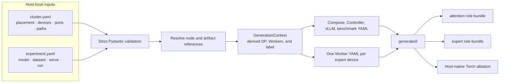

# Ascend deployment configuration

`dev/ascend` turns two human-readable YAML files into concrete Compose and
runtime configuration for an EK deployment. Pydantic validates the inputs,
resolves logical references, and passes one `GenerationContext` to strict Jinja
templates. Generated files stay project-local and are never author inputs.

For the complete two-Host 910C procedure, see the
[Ascend deployment tutorial](../../doc/tutorial/ascend/README.md).

## Inputs and ownership

| File | Owns | Lifecycle |
| --- | --- | --- |
| `configs/cluster.example.yaml` | Documented cluster example | Checked in |
| `configs/experiment.example.yaml` | Documented experiment example | Checked in |
| `configs/cluster.yaml` | Host addresses, devices, ports, images, and paths | Host-local and ignored |
| `configs/experiment.yaml` | Model, dataset adapter, serving, and benchmark settings | Host-local and ignored |
| `templates/*.jinja` | Runtime and Compose output shapes | Checked in |
| `generated/` | Rendered Compose and runtime YAML | Generated and ignored |

All Host-side files remain inside the EK checkout under the operator's home
directory. Paths such as `/etc/expert-kit` are container-side mount targets.
The generator does not use deployment `.env` files.

### `cluster.yaml`

`cluster.yaml` describes where the deployment runs:

- the stable Docker Compose `project_name`;
- attention, control, and expert role placement;
- physical NPU IDs and published Host ports;
- runtime image references and Worker limits;
- model, dataset, and result path registries.

`project_name` is the Compose resource namespace. It is separate from
`inference.instance_name`, which identifies the EK runtime instance.

### `experiment.yaml`

`experiment.yaml` describes what to run:

- model identity, shape, and `path_ref`;
- dataset parser and optional `path_ref`;
- vLLM serving limits;
- prompt count, concurrency, output length, warmups, and sampling settings.

`model.path_ref` indexes `cluster.paths.models`. A file-backed dataset's
`dataset.path_ref` indexes `cluster.paths.datasets`.

| Dataset type | Required path fields | Prompt length |
| --- | --- | --- |
| `random` | None | `run.input_len` is required |
| `sharegpt` | `path_ref`, `mounted_path`, `file` | Read from the dataset; omit `run.input_len` |
| `custom` | `path_ref`, `mounted_path`, `file` | Read from the dataset; omit `run.input_len` |

`dataset.name` is a human-readable result-label component. `dataset.type`
selects the vLLM parser.

## File tree

```text
dev/ascend/
├── README.md
├── main.py                         # Typer generate command
├── renderer.py                     # StrictUndefined Jinja renderer
├── bench_launcher.py               # vLLM benchmark YAML adapter
├── run-compose.sh                  # selects one generated role bundle
├── schemas/                        # input and generation-context models
├── configs/
│   ├── cluster.example.yaml
│   ├── experiment.example.yaml
│   ├── cluster.yaml                    # ignored
│   └── experiment.yaml                 # ignored
├── compose/
│   └── compose.build.yaml              # image builds
├── templates/
│   ├── compose.attention*.yaml.jinja
│   ├── compose.expert*.yaml.jinja
│   ├── controller.yaml.jinja
│   ├── worker.yaml.jinja
│   ├── vllm-serve.yaml.jinja
│   ├── vllm-bench.yaml.jinja
│   └── torch-bench.yaml.jinja
└── generated/                      # ignored
    ├── compose.attention*.yaml
    ├── compose.expert*.yaml
    ├── controller.yaml
    ├── vllm-serve.yaml
    ├── vllm-bench.yaml
    ├── torch-bench.yaml            # ShareGPT only
    └── workers/worker-NN.yaml
```

## Data flow



Role and artifact contexts retain their source configuration together with the
resolved node or path. Their serializers flatten that structure for templates,
so Jinja uses values such as `attention.address`, `model.path`, and
`dataset.mounted_path` directly.

## Generate and validate

Create the ignored local inputs once:

```bash
cp dev/ascend/configs/cluster.example.yaml dev/ascend/configs/cluster.yaml
cp dev/ascend/configs/experiment.example.yaml dev/ascend/configs/experiment.yaml
```

Replace every placeholder, then generate from the repository root:

```bash
uv run dev/ascend/main.py generate
```

Explicit paths are available for automation:

```bash
uv run dev/ascend/main.py generate \
  --cluster dev/ascend/configs/cluster.yaml \
  --experiment dev/ascend/configs/experiment.yaml \
  --output dev/ascend/generated
```

Generation rejects unknown fields, unresolved references, invalid dataset/run
combinations, and undefined template variables. Validate both generated
Compose role bundles before deployment:

```bash
dev/ascend/run-compose.sh attention config -q
dev/ascend/run-compose.sh expert config -q
```

`main.py` currently generates configuration only. Host preflight, deployment
locks, artifact distribution, and service lifecycle commands remain outside
this prototype.
