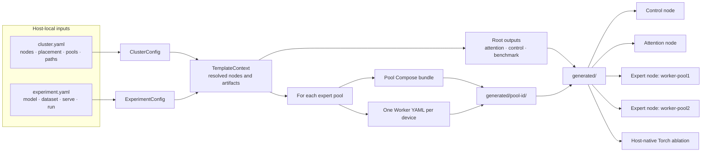

# Ascend deployment configuration

`dev/ascend` turns two human-readable YAML inputs into concrete Compose and
runtime configuration for an EK deployment. Pydantic validates the inputs,
resolves node and artifact references, and constructs one `TemplateContext` for
strict Jinja templates. Generated files stay project-local and are never author
inputs.

The [Ascend deployment tutorials](../../doc/tutorial/ascend/README.md) contain
the common deployment workflow and model-specific checkpoint, geometry,
memory, and qualification requirements.

## Inputs and ownership

| File | Owns | Lifecycle |
| --- | --- | --- |
| `configs/qwen3-30b-a3b/*.example.yaml` | Qwen3 cluster and experiment pair | Checked in |
| `configs/deepseek-v3/*.example.yaml` | DeepSeek-V3 BF16 cluster and experiment pair | Checked in |
| `configs/cluster.yaml` | Host addresses, placement, devices, ports, images, and paths | Host-local and ignored |
| `configs/experiment.yaml` | Model, dataset adapter, serving, and benchmark settings | Host-local and ignored |
| `templates/*.jinja` | Runtime and Compose output shapes | Checked in |
| `generated/` | Rendered Compose and runtime YAML | Generated and ignored |

All Host-side inputs and outputs remain inside the EK checkout under the
operator's home directory. Paths such as `/etc/expert-kit` in generated Compose
files are container-side mount targets. Deployment values do not come from a
`.env` file.

### `cluster.yaml`

`cluster.yaml` describes where the deployment runs:

- `project_name` supplies the stable Compose resource prefix;
- `attention` and `control` bind the frontend services to a node;
- `expert.runtime` supplies limits shared by every expert Worker;
- `pools` binds each expert node to its devices and published port ranges;
- `nodes` maps logical node names to routable Host addresses;
- `paths` maps model and dataset references to Host paths.

`project_name` is a Compose namespace. It is separate from
`inference.instance_name`, which identifies the EK runtime instance.

### Multi-pool placement

Each `PoolConfig` represents the Workers deployed on one expert node:

```yaml
pools:
  - id: worker-pool1
    node: node-b
    devices: [0, 1, 2, 3]
    start_worker_port: 53234
    start_peer_port: 54234

  - id: worker-pool2
    node: node-c
    devices: [0, 1, 2, 3]
    start_worker_port: 53234
    start_peer_port: 54234
```

Pool IDs must be unique. An ID becomes both a generated directory name and a
Compose project-name suffix. The generator creates one Worker per device. Port
ranges may be reused across different nodes because each range is bound to that
node's Host address.

Worker filenames and Compose service names are pool-local, so both pools may
contain `worker-00`. The runtime Worker ID is pool-qualified, for example
`worker-pool1-worker-00`, and is globally unique when it registers with the
Controller.

The example is an 8A32E deployment: eight attention ranks on `node-a`, sixteen
expert Workers in `worker-pool1`, and sixteen in `worker-pool2`. The current
topology keeps attention and control together and uses one pool per expert node.

### `experiment.yaml`

`experiment.yaml` describes what to run:

- model identity, shape, dtypes, and `path_ref`;
- dataset parser, label name, and optional `path_ref`;
- vLLM serving limits;
- prompt count, concurrency, output length, warmups, and sampling settings.

`model.path_ref` indexes `cluster.paths.models`. A file-backed dataset's
`dataset.path_ref` indexes `cluster.paths.datasets`.

| Dataset type | Required path fields | Prompt length |
| --- | --- | --- |
| `random` | None | `run.input_len` is required |
| `sharegpt` | `path_ref`, `mounted_path`, `file` | Read from the dataset; omit `run.input_len` |
| `custom` | `path_ref`, `mounted_path`, `file` | Read from the dataset; omit `run.input_len` |

`dataset.name` is a human-readable result-label component. `dataset.type`
selects the benchmark parser.

## File tree

```text
dev/ascend/
├── README.md
├── cli.py                          # Typer generate command
├── generate.py                     # output expansion
├── renderer.py                     # StrictUndefined Jinja renderer
├── bench_launcher.py               # vLLM benchmark YAML adapter
├── run-compose.sh                  # selects image, control, attention, or pool Compose
├── schemas/                        # input and template-context models
├── configs/
│   ├── qwen3-30b-a3b/
│   │   ├── cluster.example.yaml
│   │   └── experiment.example.yaml
│   ├── deepseek-v3/
│   │   ├── cluster.example.yaml
│   │   └── experiment.example.yaml
│   ├── cluster.yaml                # ignored Host-local input
│   └── experiment.yaml             # ignored Host-local input
├── compose/
│   └── compose.build.yaml          # standalone image-build defaults
├── templates/
│   ├── compose.build.yaml.jinja
│   ├── compose.control*.yaml.jinja
│   ├── compose.attention*.yaml.jinja
│   ├── compose.expert*.yaml.jinja
│   ├── controller.yaml.jinja
│   ├── worker.yaml.jinja
│   ├── vllm-serve.yaml.jinja
│   ├── vllm-bench.yaml.jinja
│   └── torch-bench.yaml.jinja
└── generated/                      # ignored exact materialization
    ├── .expert-kit-generated       # cleanup safety marker
    ├── compose.build.yaml
    ├── compose.control.dev.yaml
    ├── compose.control.yaml
    ├── compose.attention.dev.yaml
    ├── compose.attention.yaml
    ├── controller.yaml
    ├── vllm-serve.yaml
    ├── vllm-bench.yaml
    ├── torch-bench.yaml            # ShareGPT only
    ├── worker-pool1/
    │   ├── compose.expert.dev.yaml
    │   ├── compose.expert.yaml
    │   └── workers/worker-NN.yaml
    └── worker-pool2/
        ├── compose.expert.dev.yaml
        ├── compose.expert.yaml
        └── workers/worker-NN.yaml
```

The generated `compose.build.yaml` uses the image references from
`cluster.yaml`; `compose/compose.build.yaml` remains the standalone build file
with repository defaults. Build through the generated definition as described
in the [common deployment workflow](../../doc/tutorial/ascend/README.md#3-build-the-images).

## Data flow



Node and artifact contexts retain their source configuration together with the
resolved node or path. Their serializers flatten that structure for templates,
so Jinja uses values such as `attention.address`, `pool.address`, `model.path`,
and `dataset.mounted_path` directly.

`cli.py` generates configuration only. Host preflight, artifact distribution,
and service lifecycle orchestration remain outside this prototype and are
documented as operator steps in the deployment tutorials.
