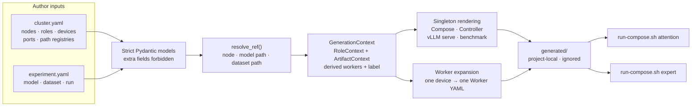

# Ascend deployment configuration prototype

`dev/ascend` replaces deployment `.env` files with two human-readable YAML
inputs. Pydantic validates them, resolves logical references, and gives one
flattened `GenerationContext` to Jinja. Jinja writes concrete runtime and
Compose YAML below the project-local, ignored `generated/` directory.

This is a prototype. `main.py generate` is the narrow configuration CLI; Host
preflight, deployment locks, distribution, and service lifecycle commands are
deferred until hardware qualification succeeds.

## File ownership

| File | Owner | Lifecycle |
| --- | --- | --- |
| `configs/cluster.example.yaml` | repository | Checked-in schema example with placeholders |
| `configs/experiment.example.yaml` | repository | Checked-in model, dataset, and benchmark example |
| `configs/cluster.yaml` | deployment operator | Ignored; real addresses, devices, ports, and Host paths |
| `configs/experiment.yaml` | deployment operator | Ignored; selected model, dataset, and benchmark settings |
| `templates/*.jinja` | repository | Checked-in output templates |
| `compose/compose.build.yaml` | repository | Standalone definitions for building the three runtime images |
| `generated/` | renderer | Ignored; never hand-edited or used as author input |
| `results/` | benchmark | Ignored benchmark output |

All Host-side files stay inside the EK checkout under the operator's home
directory. Paths such as `/etc/expert-kit` are container targets only.

## File tree

```text
dev/ascend/
├── README.md
├── .gitignore
├── main.py                         # typed generate CLI
├── renderer.py                     # StrictUndefined Jinja renderer
├── bench_launcher.py               # maps benchmark YAML to vllm bench argv
├── run-compose.sh                  # selects one generated Host-role bundle
├── schemas/
│   ├── config.py                   # strict immutable Pydantic base
│   ├── cluster.py                  # nodes, roles, devices, ports, path registries
│   ├── experiment.py               # model, dataset, and benchmark settings
│   └── context.py                  # ref resolution and GenerationContext
├── configs/
│   ├── cluster.example.yaml        # checked in
│   ├── experiment.example.yaml     # checked in
│   ├── cluster.yaml                # ignored Host-local input
│   └── experiment.yaml             # ignored run-local input
├── compose/
│   └── compose.build.yaml          # standalone image builds
├── templates/
│   ├── compose.attention.yaml.jinja
│   ├── compose.attention.dev.yaml.jinja
│   ├── compose.expert.yaml.jinja
│   ├── compose.expert.dev.yaml.jinja
│   ├── controller.yaml.jinja
│   ├── worker.yaml.jinja
│   ├── vllm-serve.yaml.jinja
│   └── vllm-bench.yaml.jinja
├── generated/                      # ignored
│   ├── compose.attention.yaml
│   ├── compose.attention.dev.yaml
│   ├── compose.expert.yaml
│   ├── compose.expert.dev.yaml
│   ├── controller.yaml
│   ├── vllm-serve.yaml
│   ├── vllm-bench.yaml
│   └── workers/worker-NN.yaml
└── results/                        # ignored
```

## Data flow



`resolve_ref()` is the common lookup primitive. A role context wraps its
configuration with a resolved node. An artifact context wraps a model or
dataset configuration with its resolved Host path. Their Pydantic serializers
flatten those nested values for Jinja, so templates use fields such as
`attention.address`, `model.path`, and `dataset.mounted_path` directly.

## Create local inputs

```bash
cp dev/ascend/configs/cluster.example.yaml \
  dev/ascend/configs/cluster.yaml
cp dev/ascend/configs/experiment.example.yaml \
  dev/ascend/configs/experiment.yaml
```

Replace every placeholder in `cluster.yaml`. Registry keys connect the two
files: `model.path_ref` indexes `cluster.paths.models`, and a file-backed
`dataset.path_ref` indexes `cluster.paths.datasets`.

`cluster.project_name` is the stable Docker Compose namespace. It prefixes
runtime containers, networks, and named volumes and is independent of
`inference.instance_name`, which identifies the EK runtime instance. Use the
same project name when generating the attention and expert role files.

Dataset fields have these meanings:

| Field | Meaning |
| --- | --- |
| `type` | vLLM parser: `random`, `sharegpt`, or `custom` |
| `name` | Human-readable dataset identity used in result labels |
| `path_ref` | Logical key for a Host dataset directory; omitted for `random` |
| `mounted_path` | Dataset directory inside the benchmark container |
| `file` | Dataset filename inside that directory |

Random datasets must omit all three path fields. ShareGPT and custom datasets
must provide all three.

`cluster.yaml` also owns exact runtime image references, the project-local
result path, Controller database/liveness values, and shared Worker limits.
`experiment.yaml` owns vLLM serving limits and benchmark request/generation
options. Stable container service names, internal ports, and mount targets stay
in the templates because they are runtime interfaces, not Host choices.
`run.input_len` is required for random data and forbidden for ShareGPT/custom,
whose files supply the prompt lengths.

## Generate files

From the repository root:

```bash
uv run python dev/ascend/main.py generate
```

Alternate project-local inputs and output directories can be selected
explicitly:

```bash
uv run python dev/ascend/main.py generate \
  --cluster dev/ascend/configs/cluster.yaml \
  --experiment dev/ascend/configs/experiment.yaml \
  --output dev/ascend/generated
```

Generation rejects unknown YAML fields, missing references, invalid dataset
path combinations, and undefined Jinja variables before writing a complete
runtime configuration.

## Build images

`compose/compose.build.yaml` is independent of the generated runtime Compose
files:

```bash
docker compose -f dev/ascend/compose/compose.build.yaml build
```

It builds and tags `ek-runtime`, `ek-worker-ascend-runtime`, and
`ek-vllm-ascend-runtime`. The attention image expects the EK attention wheels
under `dist/attention-wheels/` as required by `container/Dockerfile.npu`.

## Validate and run Compose

Validate each Host role after generation:

```bash
dev/ascend/run-compose.sh attention config -q
dev/ascend/run-compose.sh expert config -q
```

Start services on the corresponding Host:

```bash
dev/ascend/run-compose.sh attention up -d
dev/ascend/run-compose.sh expert up -d
```

Run the optional benchmark on the attention Host:

```bash
dev/ascend/run-compose.sh attention run --rm benchmark
```

`run-compose.sh` selects only the attention or expert generated pair. It does
not read `.env`, build images, or reinterpret configuration values.
